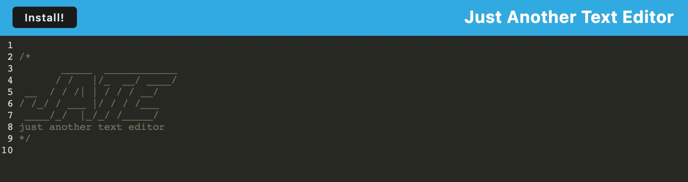

# Text Editor PWA

A simple text editor that employs the use of progressive web applications. Webpack configured for proper Progressive Web Application use. 

The purpose was to get practice configuring the modules and using the different webpack plugins to create a pwa.

## Installation 

list of Dependencies 
    "express": "^4.17.1"
    @babel/core": "^7.15.0",
    "@babel/plugin-proposal-object-rest-spread": "^7.20.7",
    "@babel/plugin-transform-runtime": "^7.15.0",
    "@babel/preset-env": "^7.15.0",
    "@babel/runtime": "^7.15.3",
    "babel-loader": "^8.2.2",
    "css-loader": "^6.2.0",
    "html-webpack-plugin": "^5.3.2",
    "http-server": "^0.11.1",
    "style-loader": "^3.2.1",
    "webpack": "^5.51.1",
    "webpack-cli": "^4.8.0",
    "webpack-dev-server": "^4.0.0",
    "webpack-pwa-manifest": "^4.3.0",
    "workbox-webpack-plugin": "^6.2.4"

## Usage

See a simple application use PWAs 

[link to Application](https://jate-text-editor-pwa-dss-04dc557918e0.herokuapp.com/)

## Credits

Starter code from DU-coding bootcamp

